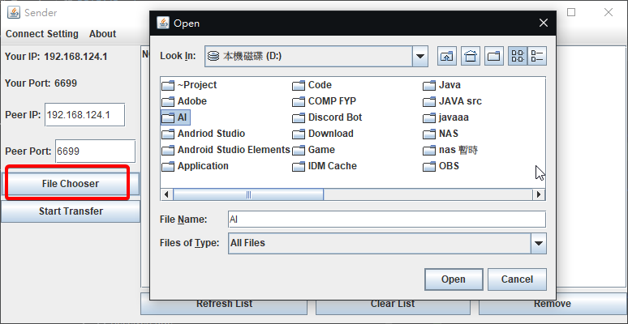

# FileTransfer

# About The Project
In this project, I have developed a java application that allows users to transfer files using TCP sockets. This project is still a work in progress and there are still many improvements to be done. At the current stage, it works fine.

## Features
1. Both sender and receiver can select the files they want via JTree with checkboxes
    - I had an experience where someone sent me a zip file with a lot of stuff I didn't want
2. The sender can select a folder and will send all files within that folder
    - No need to select files one by one
    - No need to compress files into single-use zip files, wasting sender storage space
3. The receiver will download the files immediately without compression
4. Progress bars for sneding and  receiving files
5. Notifications and information
    - To sender, a notification after receiver received all the files he wants 
    - To sender and receiver, showing information of connected IP address and used port
6. Save your receive port preference
7. Free to use ^_^

# Getting Started
## Requirements

1. Java 8 is required (JDK 1.8)
2. Router port forwarding is required
    - [ASUS] as an example, please find your router brand

## How to start
Choose one of the options below:
1. run FileTransfer.jar
2. run FileTransfer.exe
> Make sure you meet the above requirements

## Screenshot

## - Sender
### Step 0. Sender Default Page

### Step 1. Input receiver IP & port

### Step 2. Choose files / folder for selection

### Step 3. Choose files / folder to transfer

### Step 4. Start transfer files

### Step 5. Files transfer progress

### Step 6. Reminder to Sender

## - Receiver

### Step 0. Router port forwarding & set port

### Step 1. Show sender's files

### Step 2. Delete files don't want

### Step 3. Confirm files want

### Step 4. Change Path if needed

### Step 5. Start receive

### Step 6. Receiver progress bar

### Step 7. Reminder to Receiver

### Step 8. Check Download path

# TO-DO List
1. Improve code logic 
    - way to check which files receiver want (Have some new idea)
    - use less ram or use less time, find the times difference of two approach
2. Better GUI
    - Intellij GUI designer is not a great tool to use.
3. Hope there is time

## Reference I used, Thank you all
May not be all the resources I used and I edited most of them to fit my own purposes.
- [JCheckboxTree]
- [IPv4]
- [JTree]

[ASUS]:<https://www.asus.com/en/support/FAQ/114093//>
[JCheckboxTree]:<https://stackoverflow.com/questions/21847411/java-swing-need-a-good-quality-developed-jtree-with-checkboxes/>
[IPv4]:<https://stackoverflow.com/questions/40912417/java-getting-ipv4-address/>
[JTree]:<https://itqna.net/questions/7107/how-get-all-paths-jtree/>

